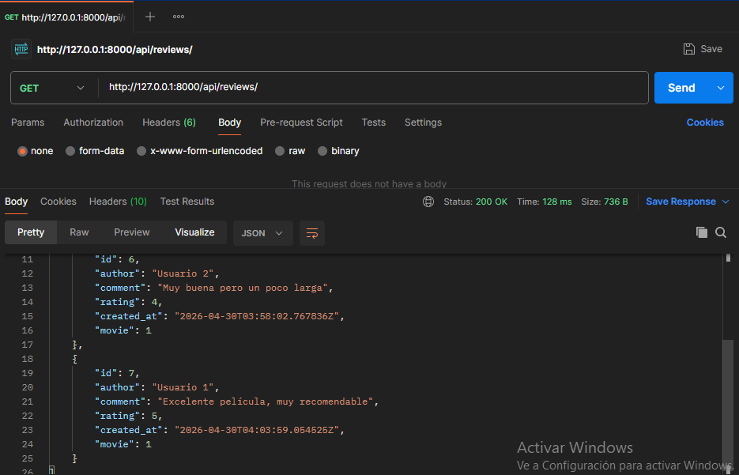

# 🎬 CINE-SPOILERS

Aplicación backend desarrollada con Django REST Framework que permite gestionar películas, categorías, géneros y reseñas, mostrando información y spoilers de tus películas favoritas mediante una API REST.

## Evidencias-Sheila Diaz Rojas

### 🚀 Django corriendo

### 🎬 Crear película

### 🧩 Crear categoría

### 🎬 Movie con Category y Genres

### ⭐ Reviews (Seed + POST)
Se implementó una nueva app reviews que permite registrar reseñas de películas, incluyendo autor, comentario y puntuación.
Además, se añadió un comando personalizado (seed) para generar datos de prueba automáticamente, y se validó la creación de reviews tanto de forma automática como manual mediante la API.

